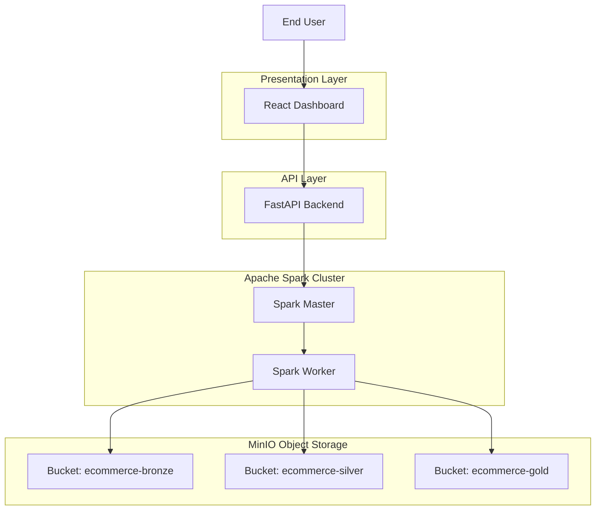
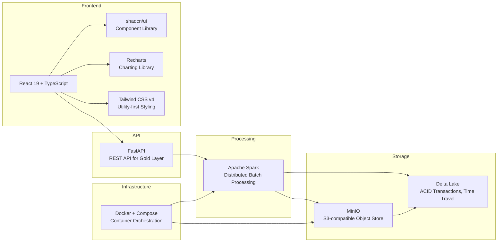
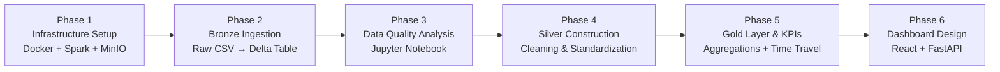

# 🏪 Data Lakehouse for E-Commerce Analytics

A complete, containerized **Data Lakehouse** implementation for analyzing online retail transactions, built with **Apache Spark**, **MinIO**, **Delta Lake**, and a **React dashboard**.

---

## 📖 Project Overview

This project demonstrates a modern data engineering pipeline based on the **Medallion Architecture** (Bronze → Silver → Gold).  
It ingests raw e‑commerce data, profiles and cleans it, computes business KPIs, and visualizes insights on an interactive dashboard — all running locally within Docker.

> 📚 **Detailed documentation** (in Persian) is available inside each phase folder.

---

## 🏗️ Architecture



### Data-Lakehouse Architecht

```text
┌─────────────────────────────────────────────────────────────────────┐
│                        DATA LAKEHOUSE ARCHITECTURE                  │
├─────────────────────────────────────────────────────────────────────┤
│                                                                     │
│  ┌──────────┐     ┌─────────────────┐     ┌──────────────────────┐  │
│  │  CSV     │────▶│  Apache Spark   │────▶│  MinIO (Object Store)│  │
│  │  (Raw)   │     │  (Compute)      │     │  - ecommerce-bronze  │  │
│  └──────────┘     └─────────────────┘     │  - ecommerce-silver  │  │
│                                           │  - ecommerce-gold    │  │
│                                           └──────────┬───────────┘  │
│                                                      │              │
│   ┌──────────────────────────────────────────────────┘              │
│   │                                                                 │
│   ▼                                                                 │
│  ┌─────────────────┐     ┌─────────────────┐     ┌──────────────┐   │
│  │  FastAPI        │────▶│  React +        │────▶│  User        │   │
│  │  (Backend API)  │     │  shadcn/ui      │     │  (Browser)   │   │
│  └─────────────────┘     └─────────────────┘     └──────────────┘   │
│                                                                     │
│  ┌──────────────────────────────────────────────────────────────┐   │
│  │  Docker Compose                                              │   │
│  │  ┌────────┐ ┌──────────────┐ ┌──────────────┐ ┌────────────┐ │   │
│  │  │ minio  │ │ spark-master │ │ spark-worker │ │  jupyter   │ │   │
│  │  └────────┘ └──────────────┘ └──────────────┘ └────────────┘ │   │
│  │  ┌───────────────────┐ ┌─────────────────────┐               │   │
│  │  │ dashboard-backend │ │ dashboard-frontend  │               │   │
│  │  └───────────────────┘ └─────────────────────┘               │   │
│  └──────────────────────────────────────────────────────────────┘   │
│                                                                     │
└─────────────────────────────────────────────────────────────────────┘
```

### Tool Selection



## 🚀 Phases

| Phase | Topic | Key Deliverables |
| --- | --- | --- |
| Phase 1 | Infrastructure Setup | Docker Compose, Spark + MinIO integration |
| Phase 2 | Bronze Layer Ingestion | Raw **CSV** → Delta table with ingestion_time |
| Phase 3 | Data Quality Analysis | Jupyter notebook profiling nulls, duplicates, outliers |
| Phase 4 | Silver Layer Construction | Cleaning, standardization, deduplication |
| Phase 5 | Gold Layer & KPIs | Aggregated tables + Time Travel demo |
| Phase 6 | Analytics Dashboard | React + FastAPI dashboard with charts |

### Pipeline Operation



## 🛠️ Technology Stack

| Category                    | Technology                                                    |
| --------------------------- | ------------------------------------------------------------- |
| **Compute Engine**          | Apache Spark 3.5 (PySpark)                                    |
| **Object Storage**          | MinIO (S3-Compatible Object Store)                            |
| **Table Format**            | Delta Lake (ACID Transactions, Time Travel, Schema Evolution) |
| **Containerization**        | Docker & Docker Compose                                       |
| **Backend API**             | FastAPI                                                       |
| **Frontend Dashboard**      | React 19, TypeScript, Tailwind CSS v4, shadcn/ui, Recharts    |
| **Development Environment** | Jupyter Notebook (PySpark Kernel)                             |

---

## ⚙️ Prerequisites

Before running the project, make sure the following requirements are installed:

* Docker Desktop **4.30+**
* Minimum **4 GB RAM** allocated to Docker
* Git

> **Note**
>
> All other dependencies, including Apache Spark, MinIO, Python packages, and supporting services, are bundled within the Docker containers.

---

## 🚀 Quick Start

## 1. Clone the Repository

```bash
git clone https://github.com/your-username/data-lakehouse-ecommerce.git
cd data-lakehouse-ecommerce
```

## 2. Start Infrastructure Services

```bash
cd phase1-infrastructure
docker compose up -d
```

This will start:

* MinIO
* Spark Master
* Spark Worker
* Jupyter Notebook
* Dashboard Backend
* Dashboard Frontend

---

## 3. Create MinIO Buckets

Open the MinIO Console:

```text
http://localhost:9001
```

**Credentials**

```text
Username: minioadmin
Password: minioadmin
```

Create the following buckets:

```text
ecommerce-bronze
ecommerce-silver
ecommerce-gold
```

---

## 4. Run the Data Pipeline

Execute the notebooks or PySpark jobs for:

* Phase 2 — Data Ingestion
* Phase 3 — Data Cleaning & Validation
* Phase 4 — Data Transformation
* Phase 5 — Gold Layer Analytics

Refer to the README inside each phase directory for detailed instructions.

---

## 5. Launch the Dashboard

Once the backend and frontend services are running, open:

```text
http://localhost:3000
```

---

## ✨ Key Features

### 🥉 Bronze Layer

* Raw data ingestion from CSV files
* Data stored in Delta Lake format
* Immutable source-of-truth storage

### 🥈 Silver Layer

* Data profiling and quality assessment
* Cleaning and validation pipelines
* Schema standardization

### 🥇 Gold Layer

* Business-ready analytical datasets
* KPI aggregation and reporting tables
* Optimized for dashboard consumption

### 🔄 Delta Lake Capabilities

* ACID Transactions
* Time Travel Queries
* Version History
* Schema Evolution
* Reliable Data Management

### 📊 Business Analytics

* Daily Sales Analysis
* Monthly Revenue Trends
* Top Selling Products
* Customer Segmentation
* Geographic Performance Analysis

### 🎨 Modern Dashboard

* React 19
* TypeScript
* Tailwind CSS v4
* shadcn/ui Components
* Recharts Visualizations

### 🐳 Containerized Infrastructure

* Fully Dockerized Environment
* Reproducible Development Setup
* One-Command Deployment

---

## 📁 Project Structure

```text
data-lakehouse-ecommerce/
├── phase1-infrastructure/        # Docker Compose, Spark & MinIO images
├── phase2-bronze-ingestion/      # CSV → Delta (Bronze)
├── phase3-data-quality/          # Profiling notebook
├── phase4-silver-layer/          # Cleaning notebook
├── phase5-gold-layer/            # Aggregation & Time Travel notebook
├── phase6-dashboard/             # FastAPI backend + React frontend
├── .gitignore
└── README.md                     # ← you are here
```

## 📜 License

This project is created for educational purposes as part of a university assignment.
Feel free to use, modify, and share.
